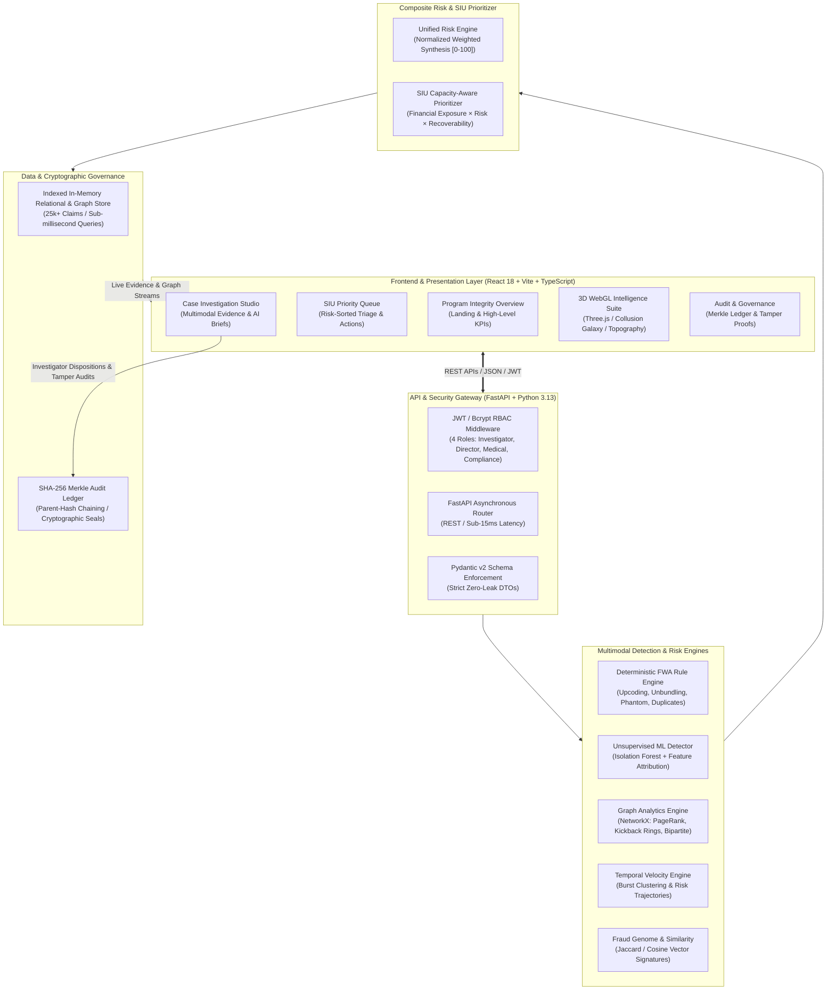
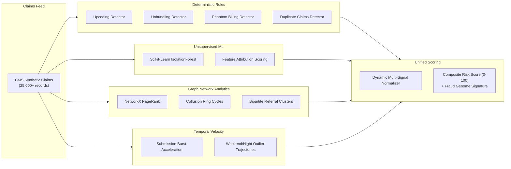
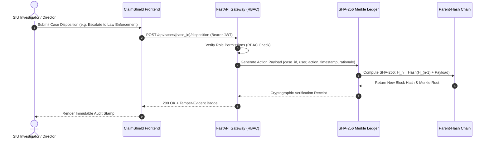

# ClaimShield Nexus — Technical Architecture & Technology Stack Specification

---

## 1. Executive Overview

**ClaimShield Nexus** is an enterprise-grade **Healthcare Program Integrity & Payment Integrity Intelligence Platform** built to detect, investigate, and mitigate Fraud, Waste, and Abuse (FWA) across large-scale Medicare and Medicaid claims portfolios.

The platform combines **multi-modal detection engines** (deterministic rules, unsupervised machine learning, graph network collusion analysis, and temporal velocity modeling) with an **interactive 3D WebGL cyber-intelligence suite** and a **cryptographically verifiable SHA-256 Merkle audit trail**.

---

## 2. End-to-End System Architecture

---

## 3. Technology Stack Detailed Breakdown

### A. Frontend Layer (UI & Visual Ergonomics)
* **Framework:** React `18.3.1` (Strict Mode, Hooks, Context Providers)
* **Language:** TypeScript `5.7.2` (Full structural typing across 100% of contracts)
* **Build System:** Vite `6.0.11` (Hot Module Replacement, optimized Rollup chunking)
* **Design & Styling System:**
  * **Tailwind CSS `3.4.17`**: Custom palette inspired by Acentra Health brand tokens:
    * Primary Brand Dark: `#042126` (Deep Spruce Teal)
    * Secondary Teal: `#005F68` (Vibrant Cyan-Teal)
    * Accent Emerald: `#28C840` / `#209B47` (Action & Verified Green)
    * Soft Aqua Highlight: `#ACF2E5` (Data & Text Glow)
    * Cyber Space Canvas: `#050811` (Deep Space Dark Mode)
  * **Typography Lockup:**
    * `Poppins (600)` — Primary Logo & Brand Lockup
    * `Inter (600)` — Subheadings & Monospaced Control Elements
    * `Plus Jakarta Sans` — UI Headings, Card Labels & Body Text
    * `JetBrains Mono` — High-precision Numbers, NPIs, CPT Codes, Currency, Hashes
* **Iconography:** Lucide React (`0.474.0`)
* **2D Visualizations:** Recharts (`2.15.1`)

---

### B. 3D WebGL Intelligence Suite (Hardware-Accelerated)
* **Graphics Core:** Three.js (`0.186.1`) with WebGL 2.0 rendering pipelines
* **Components:**
  1. **🌌 3D "Collusion Galaxy" (`CollusionGalaxy3D.tsx`)**:
     * 3D force-directed constellation graph visualizing provider networks.
     * Dynamic node geometries: Doctor NPIs (glowing cyan spheres), Shell Clinics (amber rotating cubes), Flagged Patients (pulsing micro-spheres).
     * Translucent fiber-optic links with animated streaming photon particles simulating illicit money flow.
     * Inertial orbit, pan, smooth zoom, and camera fly-to focus.
  2. **🏔️ 3D "Risk Topography" (`RiskTopography3D.tsx`)**:
     * Dynamic 3D elevation mesh mapping provider financial exposure ($) against multi-detector risk scores.
     * Contour wireframes, heat gradient shaders (Emerald $\rightarrow$ Amber $\rightarrow$ Crimson), and peak risk locator beacons.
  3. **⏳ 3D "Temporal Burst Spiral" (`TemporalBurstSpiral3D.tsx`)**:
     * 3D time-spiral helix plotting claims across 24-hour cycles and chronological days.
     * Spatial cluster detection isolating anomalous nighttime/weekend submission bursts.

---

### C. Backend & API Services
* **Runtime:** Python `3.13.4`
* **Web Framework:** FastAPI (`>=0.115.0`)
* **ASGI Server:** Uvicorn (`>=0.30.0`) with standard async worker event loops
* **Data Validation:** Pydantic v2 (`>=2.0.0`)
* **Authentication:** PyJWT (`>=2.8.0`) + Passlib & Bcrypt (`>=4.0.0`)
* **HTTP Client:** HTTPX (`>=0.27.0`)

---

### D. AI / ML, Graph & Detection Algorithms

* **Machine Learning:** `scikit-learn` Isolation Forest for multi-dimensional anomaly detection and per-feature anomaly attribution.
* **Graph Algorithms:** `NetworkX` graph traversal for community clustering, degree centrality, betweenness, and circular kickback chain identification.
* **Vector Math & Matrix Compute:** `numpy` (`>=1.24.0`) for vectorized velocity derivatives and composite score matrix calculations.
* **Synthetic Data Generation:** `Faker` (`>=25.0.0`) customized with CMS Medicare/Medicaid taxonomies (CPT/HCPCS, ICD-10, NPIs, Place of Service codes).

---

### E. Security, Governance & Cryptographic Auditing

* **Cryptographic Tamper-Evidence:** SHA-256 chained hash ledger where each action incorporates the previous block's hash. Any modification breaks the Merkle root.
* **Role-Based Access Control (RBAC):**
  1. `SIU Investigator`: Case triage, evidence exploration, review notes, disposition logging.
  2. `Medical Director`: Clinical medical-necessity overrides, policy reviews, clinical annotations.
  3. `Compliance Officer`: Audit trail inspection, Merkle ledger verification, regulatory reporting.
  4. `SIU Director`: Portfolio governance, resource threshold adjustments, law enforcement referrals.

---

## 4. Test Suite & Reliability Engineering

* **Framework:** `pytest` (`>=8.0.0`) with Starlette TestClient
* **Test Suite Coverage:** 41 comprehensive integration and unit test suites:
  * `test_api_endpoints.py`: All REST API contracts and auth guards.
  * `test_rules.py`: Upcoding, unbundling, phantom, and duplicate rule engines.
  * `test_ml_detector.py`: Isolation Forest anomaly scoring and attribution.
  * `test_graph_engine.py`: Network construction and collusion detection.
  * `test_security_audit_tamper.py`: Merkle chain integrity and RBAC penetration tests.
  * `test_hardening_bug_audit.py`: Guardrails against zero-division and edge cases.
  * `test_e2e_flow.py`: Full end-to-end investigator workflow validation.

---

## 5. Technology Stack Summary Table

| Category | Technology | Version | Key Function in Platform |
| :--- | :--- | :--- | :--- |
| **Frontend Framework** | React | `18.3.1` | Reactive SPA architecture & state management |
| **Type System** | TypeScript | `~5.7.2` | Compile-time validation of backend contracts |
| **Build Tooling** | Vite | `^6.0.11` | Optimized bundling and rapid local HMR |
| **Styling** | Tailwind CSS | `^3.4.17` | Utility-first styling & Acentra Health theme tokens |
| **3D Graphics** | Three.js | `^0.186.1` | WebGL 3D Collusion Galaxy, Risk Topography & Spiral |
| **Charts** | Recharts | `^2.15.1` | Responsive 2D risk velocity curves & detector stats |
| **Icons** | Lucide React | `^0.474.0` | Accessible vector icons across navigation & tools |
| **Backend Runtime** | Python | `3.13.4` | High-efficiency asynchronous execution |
| **REST API** | FastAPI | `>=0.115.0` | Asynchronous REST endpoints and OpenAPI docs |
| **Web Server** | Uvicorn | `>=0.30.0` | High-concurrency ASGI server |
| **Data Models** | Pydantic | `>=2.0.0` | Zero-leak DTO validation and serialization |
| **Machine Learning** | Scikit-Learn | `>=1.3.0` | Unsupervised Isolation Forest anomaly detection |
| **Graph Theory** | NetworkX | `>=3.0` | Collusion ring & kickback network analysis |
| **Vector Math** | NumPy | `>=1.24.0` | Fast mathematical transforms & velocity math |
| **Data Synthesis** | Faker | `>=25.0.0` | Real-world synthetic CMS claims generation |
| **Auth & Cryptography**| PyJWT / Bcrypt | `>=2.8.0` | JWT stateless auth & salted password hashing |
| **Audit Ledger** | SHA-256 Merkle Chain | *Native* | Tamper-evident immutable governance record |
| **Automated Testing** | Pytest | `>=8.0.0` | 41 Automated unit/integration test suites |
